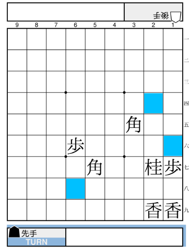

+++
title = "利き計算"
date = 2022-01-21
+++

本作は、局面が変化するたびに利き情報を再計算する(差分計算ではない)。  
利き情報は、盤面の各マスに対する利き数と attacker からなる。

## 利き数

通常の利きに加え、影の利きが考慮される。  
遠隔利きが自駒の上にあり、かつその自駒が玉でなく、遠隔利きと同一方向の利きを持てば、遠隔利きがさらに 1 歩延長される。  
具体的には以下のケースで成立する:

* 前への遠隔利きが自軍の (桂、角、玉) 以外の上にある
* 斜め前への遠隔利きが自軍の (歩、香、桂、飛、玉) 以外の上にある
* 左右または後ろへの遠隔利きが自軍の (金、飛、全ての成駒) の上にある
* 斜め後ろへの遠隔利きが自軍の (銀、角、馬、龍) の上にある

たとえば、下図では青く塗ったマスに影の利きが発生している:

前述の条件より、２六や７五の地点には影の利きが発生しないことに注意。  
また、同一方向の遠隔利きが重なっても延長されるのは 1 歩まで(上図で１三や７九の地点には影の利きが発生しない)。これを利用してCOMに実際の利き数を誤認させ、駒得を狙うこともできる。

定義より、影の利きのあるマスには必ず通常の利きが同時に存在することに注意。

## attacker {#attacker}

あるマスに直接利いている(影の利きは除く)駒種のうち、最も価値の低いものを attacker と呼ぶ。  
(価値が同じ場合、インデックスの小さいマスにあるものが優先される)

価値比較には [駒価値テーブルA](@/price-table/index.md#table-a) が使われる。

定義より、利き数が 0 でないマスには必ず attacker が存在することに注意。
